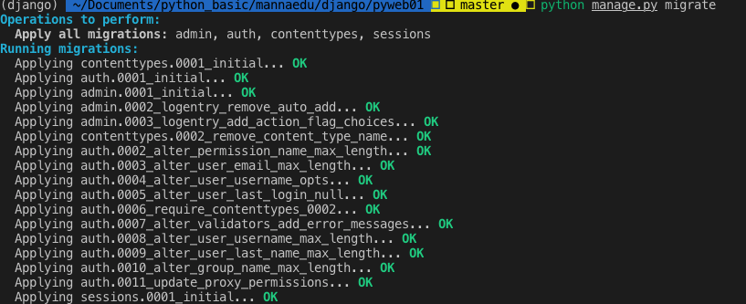
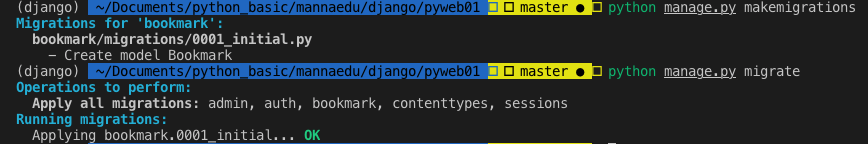

# 장고 게시판

- conda version : 4.6.14
- python : 3.6
- django : 2.1
- 가상환경 사용해서 세팅

**************************

## 설치 전 준비
- 아나콘다 설치
- VS code 설치
- django 가상환경 세팅

**************************

## 장고 버전 확인
> 장고 버전 확인

```
$ python -m django --version
```

**************************

## 주요 기능
> 글목록, 글쓰기, 수정, 삭제

> 검색 기능

> 페이지 나누기

> 댓글 쓰기, 댓글 목록

> 파일 업로드, 다운로드


**************************

## Django와 MySQL 연동 
> MySQL 스크립트

``` 
-- 데이터베이스 생성
CREATE DATABASE pyweb;

use pyweb;

-- 페이지나누기를 위한 저장 프로시저 작성
DELIMITER $$
DROP PROCEDURE if exists loopInsert$$

CREATE PROCEDURE loopInsert()
begin
declare i int default 1;
DELETE FROM board_board;
while i <= 991 do
INSERT INTO board_board (IDX, writer, TITLE, CONTENT, hit, post_date)
VALUES (i, 'kim', concat('제목', i), concat('내용 ', i), 0, now());
set i = i + 1;
end while;
end$$

DELEMITER $$

```

> MySQL 패키지 설치
```
$ pip install pymysql
```

> settings.py 설정
```
import pymysql

pymysql.install_as_MySQLdb()
DATABASES = {
    'default': {
        'ENGINE': 'django.db.backends.mysql',
        'NAME': , # DB명
        'USER': , # DB 계정
        'PASSWORD': , # 계정 비밀번호
        'HOST': 'localhost', # DB서버 주소(IP)
        'PORT': '3306', # 데이터베이스 포트(보통은 3306)
    }
}


```
**************************

## 장고 프로젝트 만들기
> 코드를 저장할 디렉토리로 이동한 후 다음 명령어 수행

``` 
$ django-admin startproject {프로젝트 이름}

ex) pyweb_board라는 이름의 프로젝트 만들기
$ django-admin startproject pyweb_board
```

**************************

## 기본 테이블 생성
> 장고 프로젝트가 생성된 디렉토리로 이동한 후 다음 명령어 수행 (python과 django 버전이 맞지 않을경우 실행이 안됨)
- python 3.6, django 2.1
```
$ cd pyweb_board
$ python manage.py migrate
```


**************************

## 슈퍼 유저 생성
> 장고 프로젝트가 생성된 디렉토리에서 다음 명령어 수행

> 아이디와 비밀번호만 입력, 이메일은 생략 가능

> 비밀번호는 8자 이상이어야 하고 영문자+숫자로 구성해야 함

ex)
- username : admin
- password : admin1234

```
$ python manage.py createsuperuser
```


**************************

## 애플리케이션 생성
> 장고 프로젝트에는 1개 이상의 애플리케이션이 있어야 함

> 1개의 프로젝트에는 여러 개의 애플리케이션 생성 가능

```
$ python manage.py startapp board
```

> settings.py에 생성한 애플리케이션 적용


**************************

## 기본 세팅 변경
> settings.py 파일에서 LANGUAGE_CODE 와 TIME_ZONE 변경
```
LANGUAGE_CODE = 'ko-kr'

TIME_ZONE = 'Asia/Seoul'
```

> 날짜 포맷 변경
```
# 날짜 포맷 변경을 위한 모듈 로딩
from django.conf.locale.ko import formats as ko_formats
# 날짜 포맷 설정
ko_formatsDATETIME_FORMAT = 'Y-m-d G:i:s'
```

> INSTALLED_APPS에 survey 앱과 debug_toolbar 추가

```
INSTALLED_APPS = [
    'django.contrib.admin',
    'django.contrib.auth',
    'django.contrib.contenttypes',
    'django.contrib.sessions',
    'django.contrib.messages',
    'django.contrib.staticfiles',
    'board',
    'debug_toolbar'
]
```

> MIDDLEWARE에 debug_toolbar.middleware.DebugToolbarMiddleware 추가
```
MIDDLEWARE = [
    'django.middleware.security.SecurityMiddleware',
    'django.contrib.sessions.middleware.SessionMiddleware',
    'django.middleware.common.CommonMiddleware',
    'django.middleware.csrf.CsrfViewMiddleware',
    'django.contrib.auth.middleware.AuthenticationMiddleware',
    'django.contrib.messages.middleware.MessageMiddleware',
    'django.middleware.clickjacking.XFrameOptionsMiddleware',
    'debug_toolbar.middleware.DebugToolbarMiddleware',
]
```

> INTERNAL_IPS 변수 추가

```
INTERNAL_IPS = ('127.0.0.1',)
```


**************************

## 웹서버 구동
> manage.py가 있는 디렉토리에서 다음 명령어 수행

```
# 기본 포트는 8000로 사용
python manage.py runserver

# 포트나 ip 변경시에는 다음과 같이 사용
python manage.py ru1nserver  localhost:80
```

> admin 페이지로 이동시에는 접속 url 끝에 /admin 입력 후 접속
- ex) localhost:8000/admin

**************************

## 테이블 생성
> 테이블을 새로 만들면 models.py와 admin.py 2개의 파일을 수정해야 함
- models.py : 테이블에 대한 모델 클래스 정의
- admin.py : models.py에 등록한 테이블이 Admin 사이트에서도 보이도록 처리

> pyweb_board/models.py
- 테이블을 하나의 클래스로 정의
- 테이블의 컬럼은 클래스의 변수로 매핑
- 테이블 클래스는 django.db.models.Model 클래스를 상속받아 정의
- 변수 자료형도 장고에서 미리 정의된 자료형 사용

> pyweb_board/admin.py
- admin 사이트에 테이블 반영

**************************


## 데이터베이스 변경 사항 반영
> 지금까지 코드로 작업한 모델 클래스들을 DB에 반영

> manage.py가 있는 디렉토리로 이동해서 다음 명령어 수행

```
python manage.py makemigrations
python manage.py migrate
```



**************************

## templates, static 폴더
> templates : 동적인 템플릿 페이지

> static : 정적인 요소들(css, javascript, image)

> App 폴더 하위 폴더로 생성