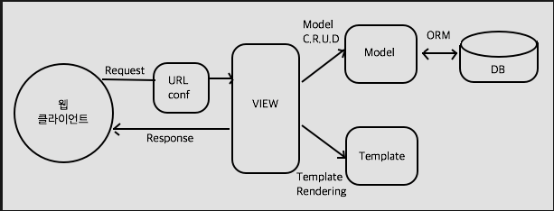
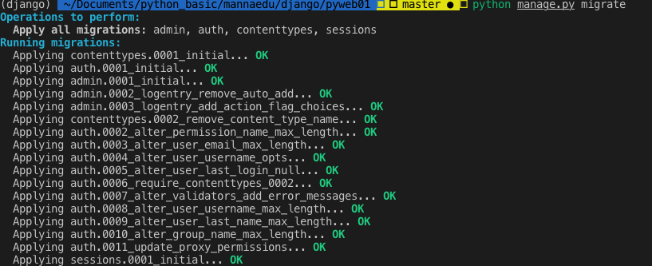

# 장고 설문조사

- conda version : 4.6.11
- django : 2.2
- 가상환경 사용해서 세팅

**************************

## 설치 전 준비
- 아나콘다 설치
- VS code 설치
- django 가상환경 세팅

**************************

## 장고 버전 확인
> 장고 버전 확인

```
$ python -m django --version
```

**************************

## 장고 간단한 소개
> 파이썬 기반의 무료 오픈소스 웹 어플리케이션 프레임워크

> 장점

- Python 기반의 프레임워크로 배우기 쉬움
- 빠른 개발속도, 개발 비용 절감
- 코드 완성도를 높게 유지할 수 있으며 확장성이 좋음
- 사용자 인증, 사용자 관리 등의 기능이 기본적으로 구현되어 있음

> MTV 패턴



> MVC pattern과 MTV pattern의 비교

MTV | MVC | 설명
----|-----|-------
Model       | Model     | 데이터베이스와 관련된 처리를 담당하는 코드
View        | Template  | 사용자가 보게되는 화면을 정의하는 코드
Controller  | View      | 데이터를 처리한 후 결과를 템플릿에게 전달하는 코드


**************************

## 장고 디버깅 툴 설치
> 디버깅을 위하여 django-debug-toolbar 설치

``` 
$ pip install django-debug-toolbar
```

**************************

## 장고 프로젝트 만들기
> 코드를 저장할 디렉토리로 이동한 후 다음 명령어 수행

``` 
$ django-admin startproject {프로젝트 이름}

ex) pyweb03라는 이름의 프로젝트 만들기
$ django-admin startproject pyweb03
```

**************************

## 기본 테이블 생성
> 장고 프로젝트가 생성된 디렉토리로 이동한 후 다음 명령어 수행

```
$ cd pyweb03
$ python manage.py migrate
```


**************************

## 슈퍼 유저 생성
> 장고 프로젝트가 생성된 디렉토리에서 다음 명령어 수행

> 아이디와 비밀번호만 입력, 이메일은 생략 가능

> 비밀번호는 8자 이상이어야 하고 영문자+숫자로 구성해야 함

ex)
- username : admin
- password : admin1234

```
$ python manage.py createsuperuser
```


**************************

## 애플리케이션 생성
> 장고 프로젝트에는 1개 이상의 애플리케이션이 있어야 함

> 1개의 프로젝트에는 여러 개의 애플리케이션 생성 가능

```
$ python manage.py startapp survey
```

> settings.py에 생성한 애플리케이션 적용


**************************

## 기본 세팅 변경
> settings.py 파일에서 LANGUAGE_CODE 와 TIME_ZONE 변경

> INSTALLED_APPS에 survey 앱과 debug_toolbar 추가

```
INSTALLED_APPS = [
    'django.contrib.admin',
    'django.contrib.auth',
    'django.contrib.contenttypes',
    'django.contrib.sessions',
    'django.contrib.messages',
    'django.contrib.staticfiles',
    'survey',
    'debug_toolbar'
]
```

> MIDDLEWARE에 debug_toolbar.middleware.DebugToolbarMiddleware 추가
```
MIDDLEWARE = [
    'django.middleware.security.SecurityMiddleware',
    'django.contrib.sessions.middleware.SessionMiddleware',
    'django.middleware.common.CommonMiddleware',
    'django.middleware.csrf.CsrfViewMiddleware',
    'django.contrib.auth.middleware.AuthenticationMiddleware',
    'django.contrib.messages.middleware.MessageMiddleware',
    'django.middleware.clickjacking.XFrameOptionsMiddleware',
    'debug_toolbar.middleware.DebugToolbarMiddleware',
]
```

> INTERNAL_IPS 변수 추가

```
INTERNAL_IPS = ('127.0.0.1',)
```


**************************

## 웹서버 구동
> manage.py가 있는 디렉토리에서 다음 명령어 수행

```
# 기본 포트는 8000로 사용
python manage.py runserver

# 포트나 ip 변경시에는 다음과 같이 사용
python manage.py ru1nserver  localhost:80
```

> admin 페이지로 이동시에는 접속 url 끝에 /admin 입력 후 접속
- ex) localhost:8000/admin

**************************

## 테이블 생성
> 테이블을 새로 만들면 models.py와 admin.py 2개의 파일을 수정해야 함
- models.py : 테이블에 대한 모델 클래스 정의
- admin.py : models.py에 등록한 테이블이 Admin 사이트에서도 보이도록 처리

> survey/models.py
- 테이블을 하나의 클래스로 정의
- 테이블의 컬럼은 클래스의 변수로 매핑
- 테이블 클래스는 django.db.models.Model 클래스를 상속받아 정의
- 변수 자료형도 장고에서 미리 정의된 자료형 사용

> survey/admin.py
- admin 사이트에 테이블 반영

**************************


## 데이터베이스 변경 사항 반영
> 지금까지 코드로 작업한 모델 클래스들을 DB에 반영

> manage.py가 있는 디렉토리로 이동해서 다음 명령어 수행

```
python manage.py makemigrations
python manage.py migrate
```

